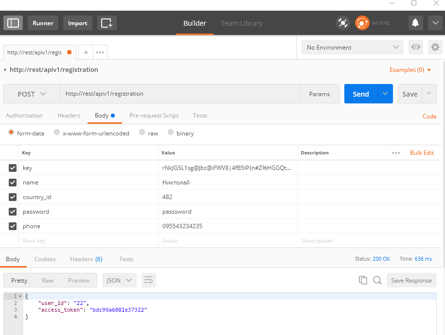

## Phalcon 3, REST api

### Инструкция

Для установки приложения необходимо использовать OSPanel(https://ospanel.io/).
В настроках опенсервера необходимо включить данные модули:

    min PHP 5.6, mySQL 5.6, Redis 2.8
    
Переходим в папку где установлен опенсервер - /OSPanel/domains/. Инициализируем GIT.

    git init
    
Клонируем репозиторий

    git clone https://github.com/jagernz/phalcon_rest_api.git
    
Также необходимо импортировать дамп SQL (таблица 'rest'), доступен по этой ссылке ( https://www.dropbox.com/s/drkfipmcjsx25ha/rest.sql?dl=0 ), можно использовать HeideSQL для импорта.

Настройки для входа в бд:
    
    "host" => "127.0.0.1",
    "username" => "root",
    "password" => "",

После этого можно использовать к примеру 'PostMan'(пoставляется как расширении Chrome) для генерации запросов согласно ТЗ.

Пример запроса ниже:

В процессе выполнения столкнулся с двумя сложностями - настройка правильного процеса фоновых задач Gearman, не получилось правильно настроить для работы, альтернатива в виде BeansTalk тоже не помогла. Так же в одном из методов PUT, не получилось средствами Phalcon получить данные Request при обработке данного метода (не работал метод getPut).